## Fault system geometry is complex

:::: {.columns}
::: {.column width="50%"}
- Western North America has 100,000+ km of imperfectly (look where the faults stop) mapped fault system
- Fractal dimensions range from 1.1 (_Okubo and Aki_, 1987) to 1.6 (_Hirata_, 1989)
:::
::: {.column width="50%"}
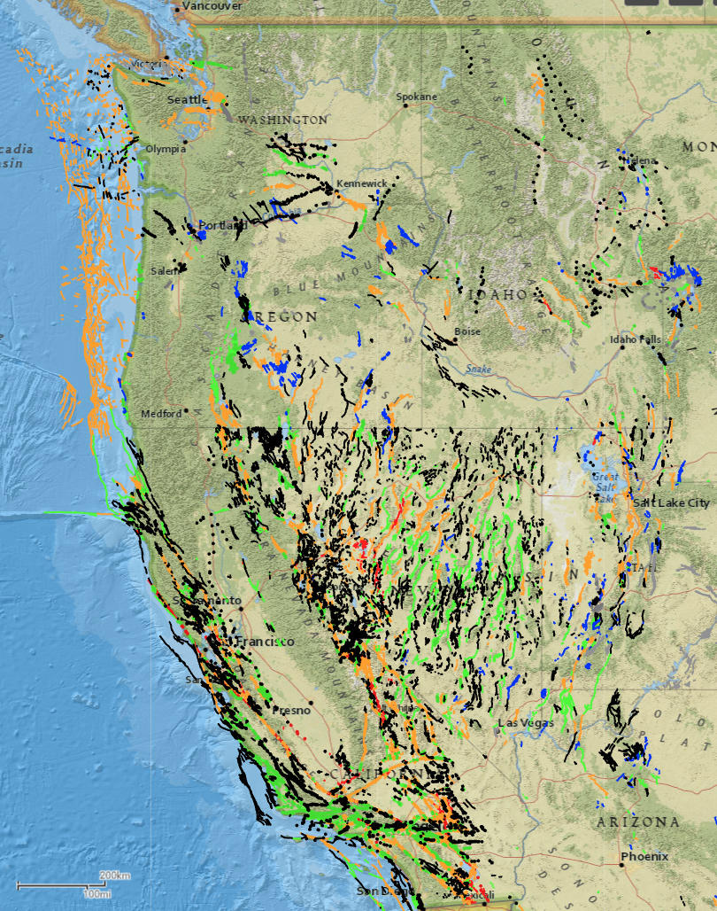{fig-align="center" width="80%"}
:::
::::

::: aside
USGS Quaternary fault and fold database
:::

## Fault system kinematics are countable

:::: {.columns}
::: {.column width="50%"}
$>90\%$ of shortening is localized on 1-5 faults at active convergent mountain belts

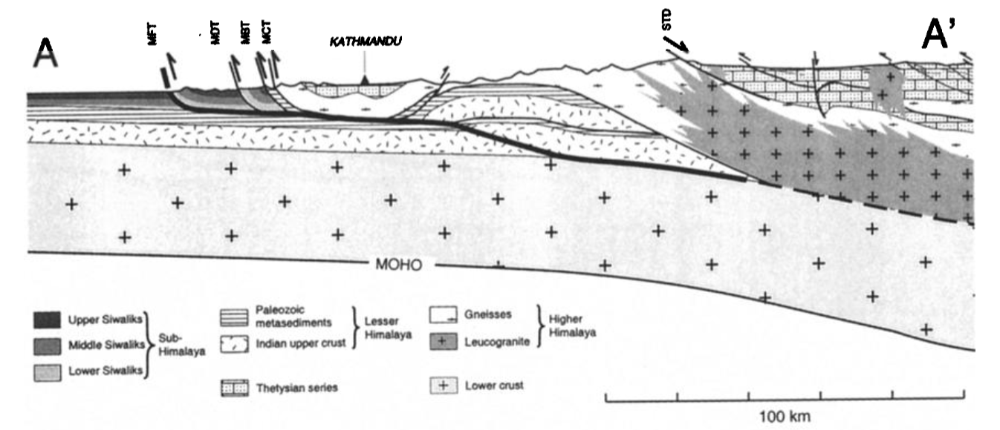{fig-align="center" width="100%"}
:::
::: {.column width="50%"}
Geology and geodesy seem to have identified the faults responsible for $>90\%$ of kinematic motion in strike-slip systems
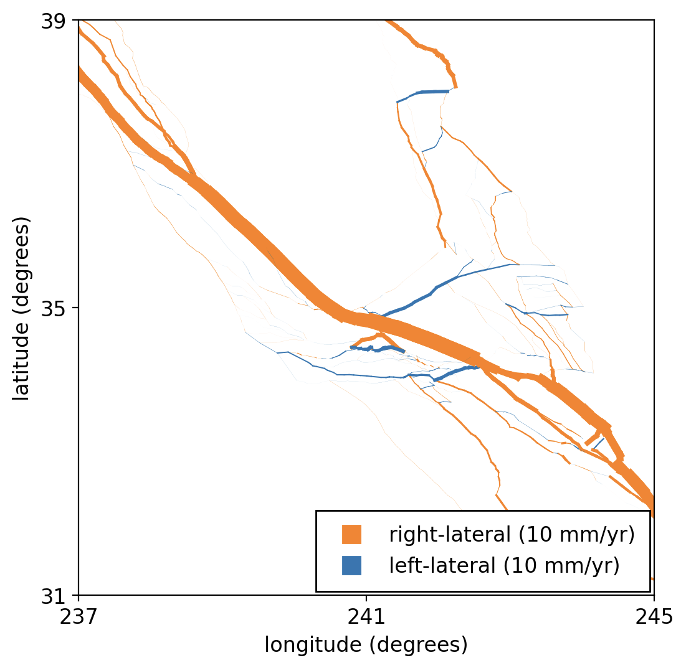{fig-align="center" width="80%"}
:::
::::

::: aside
_Minster and Jordan_, 1987; _Lave and Avouac_, 2001; _Meade and Hager_, 2005 
:::

## Modern geodetic observations show astonishing localization

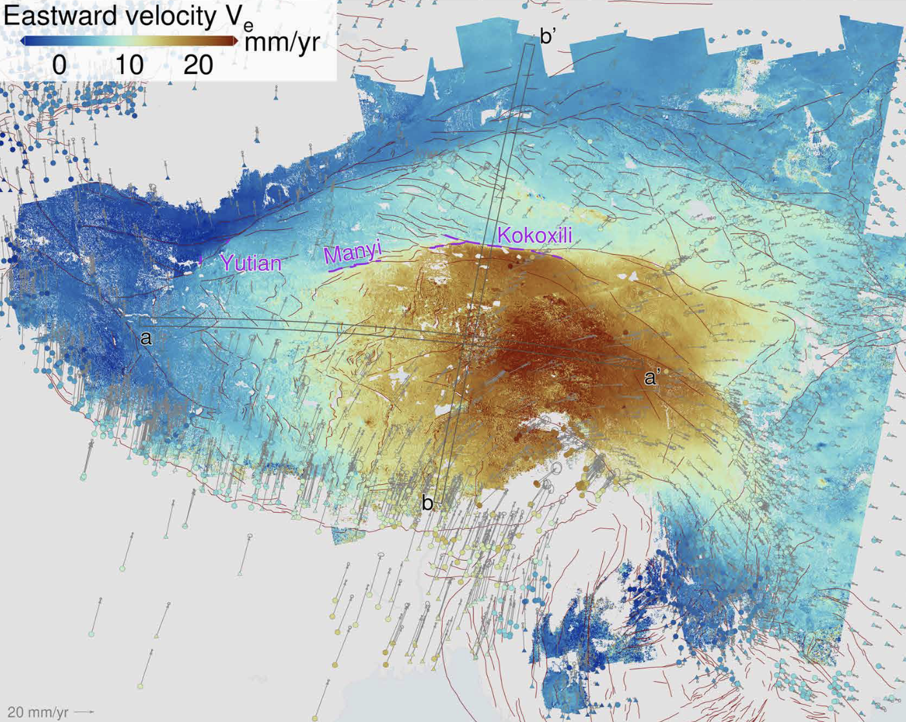{fig-align="center" width="60%"}

::: aside
_Wright et al_., 2026
:::

## Steady linear mantle flow is not geodetically detectable

Steady flow in a linear* viscous mantle produces a stress at the crust-mantle interface and the elastic layer responds with strain, not strain rate

$$\sigma_\mathrm{e} = \sigma_\mathrm{v}\;\;\; \rightarrow \;\;\;\mu \epsilon_\mathrm{e} = \eta \frac{d\epsilon_\mathrm{v}}{dt}$$

> ...geodetic observations of interseismic deformation are insensitive to the source of the driving forces in a linear system (Savage, 2000)

> ...motion in the elastic layer is decoupled from that deep within the viscous layer, and they may be very different from each other (Zatman, 2000)

> We also demonstrate that the geodetic velocities are not related to the secular velocities at depth (Hetland and Hager, 2004)

::: aside
*Non-linear rheologies make this history dependent and open up the door to connections
:::

## Some transient mantle flow is geodetically detectable

:::: {.columns}
::: {.column width="50%"}

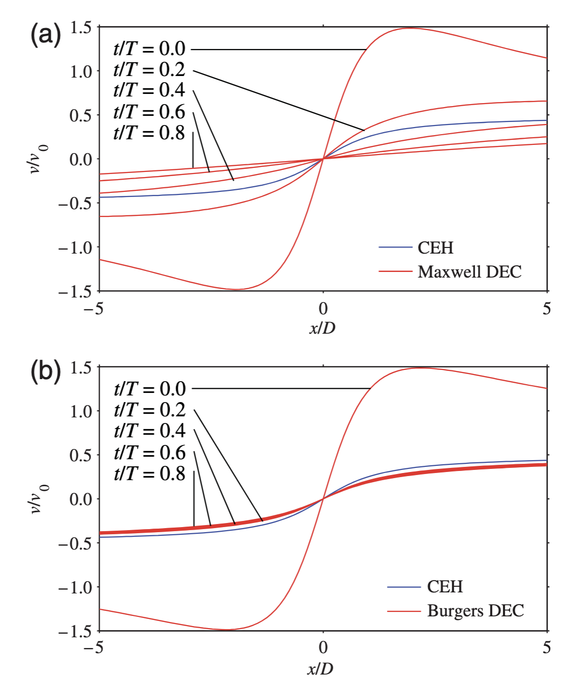{fig-align="center" width="80%"}
:::
::: {.column width="50%"}

- 1-10 year postseismic VE deformation is well documented
- ~100 year postseismic VE deformation is yet to documented
- Maxwell VE rheology is incompatible with observations
- Extended linear rheologies (e.g., Burgers and Andrade) linear and many nonlinear rheologies are consistent with observations
:::
::::

::: aside
_Hetland and Hager_ 2005, 2006, _Meade et al_., 2013
:::

## Modern perspectives on friction (geodesy)

Afterslip in the "wrong" place

> inconsistent with a simple model consisting of velocity-weakening patches obeying simple rate-state friction surrounded by a velocity strengthening interface  (Johnson et al., 2012)

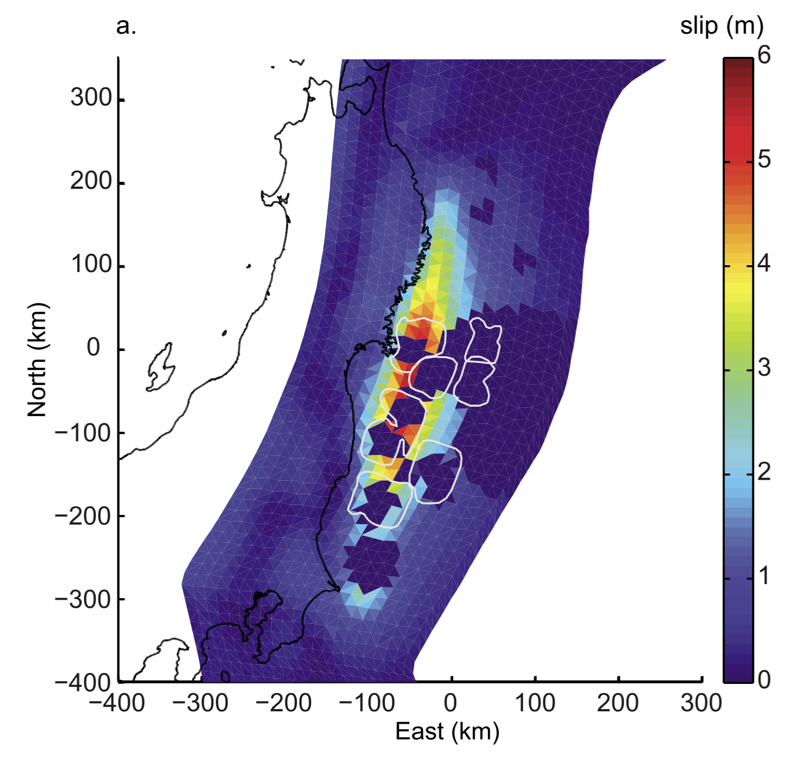{fig-align="center"}

## Modern perspectives on friction (geodesy)

Little geodetically observed surface fault creep

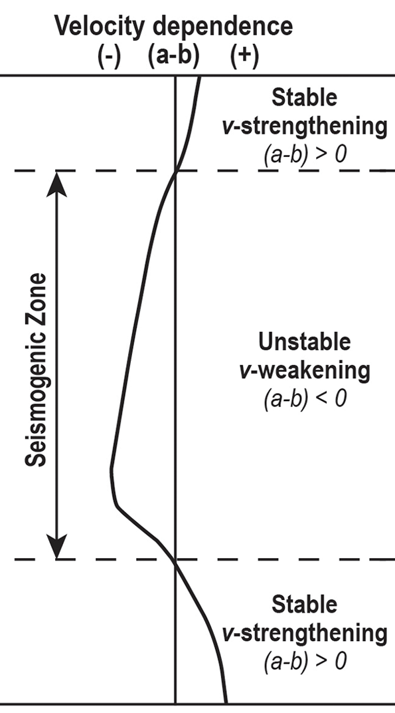{fig-align="center"}

Potential solution: frictional parameters are velocity/state/stress/history dependent rather than material properties

## Modern perspectives on friction (laboratory)

<!-- 
> ...seismogenic faults can be activated by stress perturbations by all possible models of slip independently of frictional properties. (Passelègue et al., 2020) -->

> We therefore argue here that earthquake dynamics are best understood in terms of dynamic fracture mechanics and not governed by the frictional properties of faults...We finally note that any process that includes shear and normal stresses can be interpreted in terms of "friction" (Reches and Fineberg, 2023)

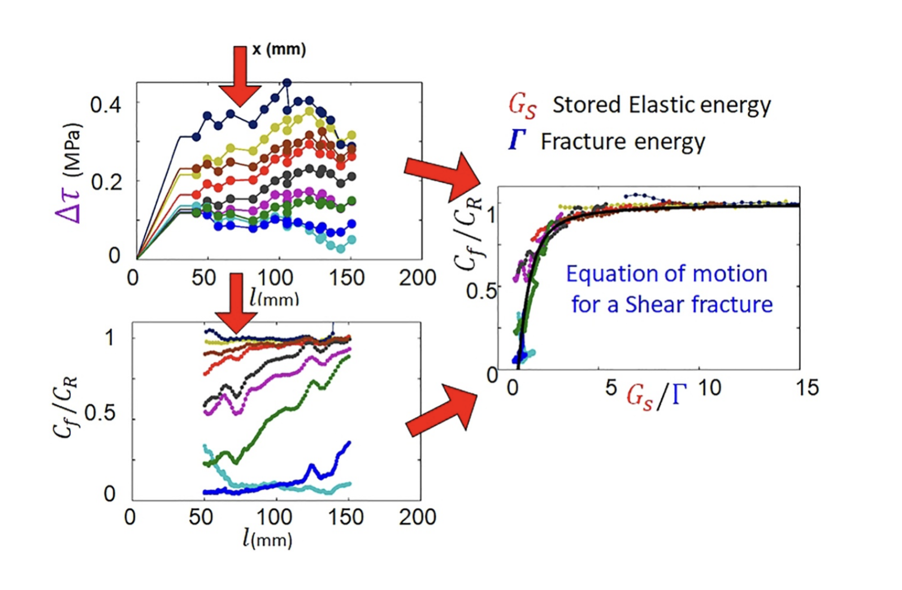{fig-align="center"}

## Slip displacement, stress, strain energy distance scaling

$$
U_{ij} = \frac{-1}{8\pi(1-\nu)r^2} \left\{ \frac{\partial r}{\partial n} \left[ (1-2\nu)\delta_{ij} + \frac{3r_i r_j}{r^2} \right] - (1-2\nu)\left[ \frac{n_i r_j}{r} -  \frac{n_j r_i}{r} \right] \right\}
$$

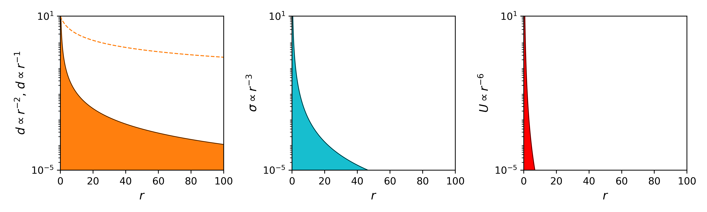{fig-align="center"}

::: {.callout-important}
### Kinematics are long distance. Energy is localized.
:::

## Stress is non-trivial to calculate in fractured media

:::: {.columns}
::: {.column width="50%"}
- Hypersingular for Dirac delta function* point source.  No known general integration method
- Linear elastic fracture mechanics (LEFM) works with weaker singularities
- Stress free formulations of continuum mechanics have been developed
:::
::: {.column width="50%"}
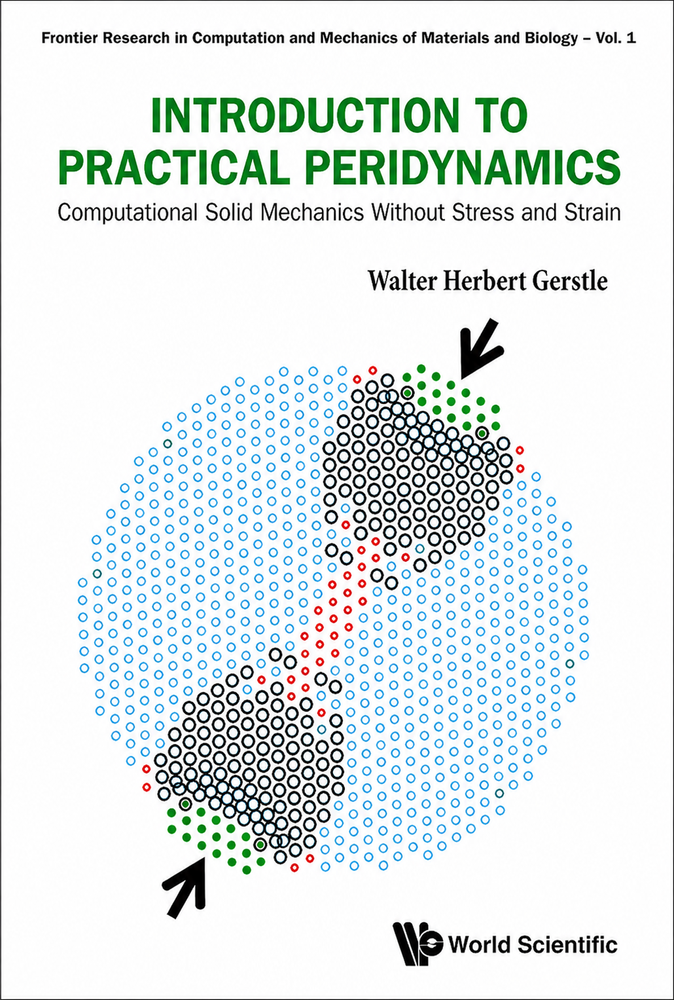{fig-align="center" width="70%"}
:::
::::

::: aside
*High order continuity (_Mallick and Meade_, 2024) and mollification (_Eringen_, 1977) can fix this
:::

## Stress and force as distributions or computational tools

- Stress is very difficult to measure
- Displacement and energy are clear are clearly interpretable

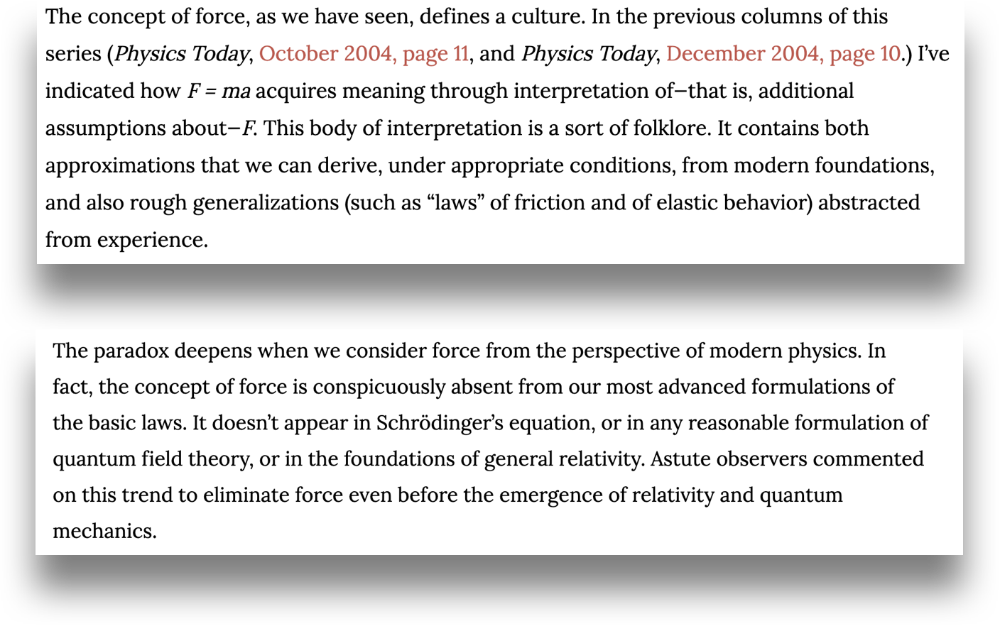{fig-align="center" width="60%"}

::: aside
_Wilcek_, 2004
:::

## The crust may be jammed and/or mathematically stiff
:::: {.columns}
::: {.column width="50%"}
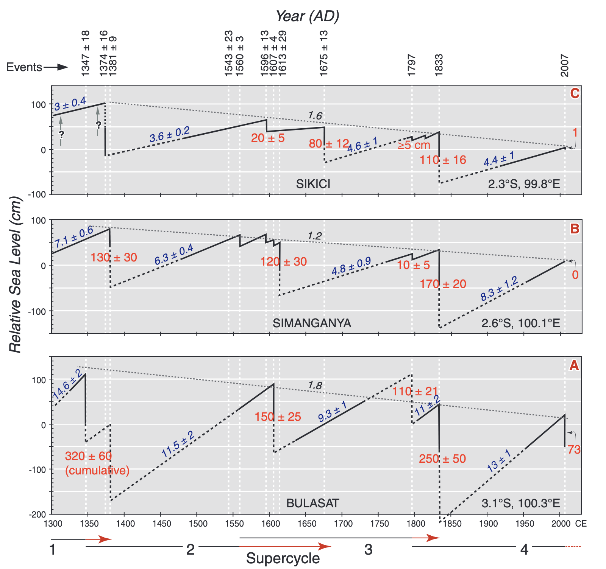{fig-align="left" width="100%"}
:::
::: {.column width="50%"}

- Slow loading with itermittent jumps (_Anderson_, 1975)
- Jamming mechanics (_Liu and Nagel_, 1998)
- Crackling noise (_Niccolini et al_., 2009)
- Contact dynamics (_Moreau_, 1999)
:::
::::

::: aside
_Sieh et al_., 2008 
:::

## A micro summary

1. 1000s of geologic slip rate estimates and 1m+ geodetic observations suggest that in the modern most motion is localized on an effectively countable number of faults despite fractal network geometry
   

2. No geodetically detectable relationship between crustal motions to mantle motions (for linear rheologies, unclear for non-linear)

3. Friction may not be a primary control on failure styles

4. Stress and strain are powerful calculation tools but are _often_ difficult to work with when there is faulting/fracture

5. If the crust is in a jammed state it is highly sensitive to small perturbations but geometrically constrained

## Paths forward: Kinematics + statistical mechanics

#### Rationale for thermodynamics

> The principle of the production of [_motion by heat_]...must be considered independently of any mechanism or…particular agent.  It is necessary to establish principles applicable not only to [_steam-engines_] but to all imaginable [_heat engines_] (Carnot, 1824)

::: {.fragment}
#### Rationale for faulting

> The principle of the production of [_fault slip_] must be considered independently of any mechanism or…particular agent.  It is necessary to establish principles applicable not only to [_elasticity, rate/state friction_] but to all imaginable [_rheologies_]
:::

## Paths forward: Kinematics + statistical mechanics

For earthquake and afterslip sequences:

  - Moment budgets: A kinematic balance concept
  - Empirical scaling laws: What we can measure
  - Maximum entropy: Everything else is maximally uncertain 

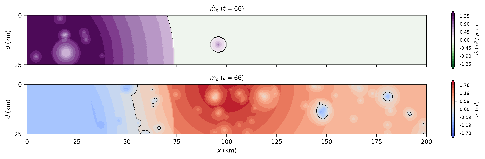{fig-align="center"}

::: aside
_Meade_, in review
:::

## Paths forward: Geometry dominated

  - Plate geometries have granular coordination numbers (_Anderson_, 2001)
  - Fault geometry changes have a crustal thickness length scale (_Klinger_, 2010)
  - Environmental soft matter is a statistical cube (_Domokos et al_., 2020)

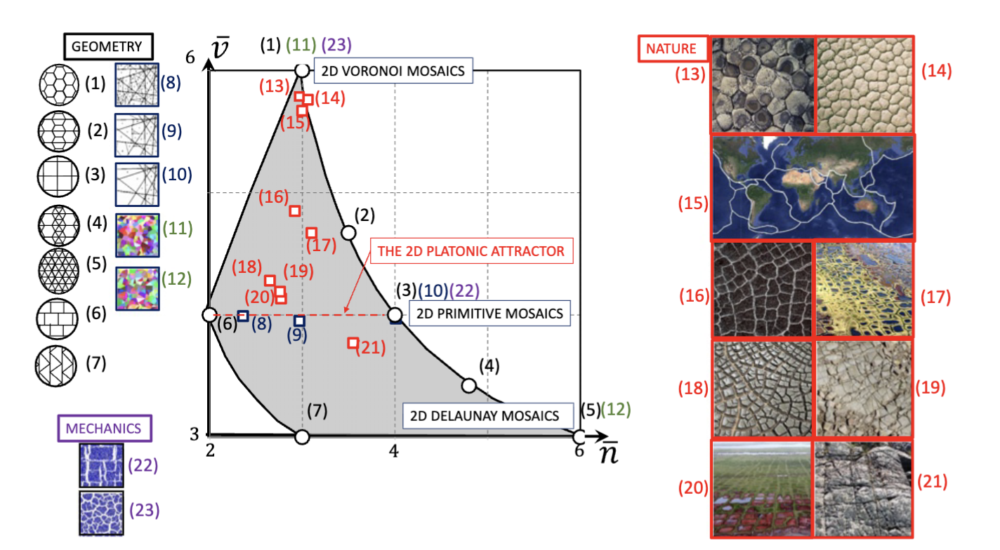{fig-align="center"}

## Paths forward: Non-linear viscous models
- Many non-linear rheologies (e.g., power-law) create more informative systems
- Pipe diffusion, $\eta = f(\sigma, \epsilon, ...)$ (_Breithaupt et al_., 2022) 

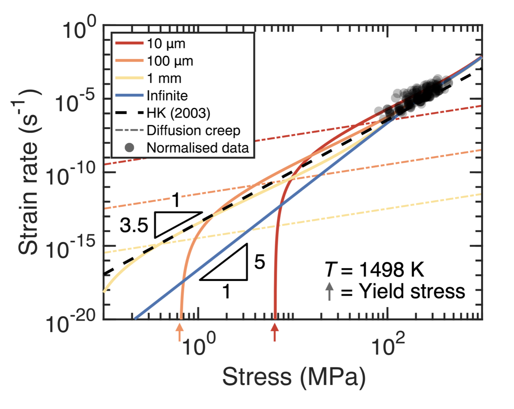{fig-align="center"}

## Paths forward: Discrete element models
- Inertial (_Cundall and Strack_, 1979) and non-inertial (_Kishino_, 1988)
- Decide with the inertial number $I = \dot{\epsilon}d \sqrt{\rho / P}$
  - Inertial non-inertial threshold $I \approx 10^{-2}$ 
  - For the Earth-like tectonics $I \approx 10^{-12}$

<video controls preload="metadata" width="500" style="display: block; margin: 0 auto;">
  <source src="img/spin_animation.mp4" type="video/mp4">
</video>

## Paths forward: Contact dynamics
- _Moreau_, 1987; _Andrews et al_., 2022
- Used widely in animation and robotics
- Non-inertial, polygonal discrete elements, with deformable bodies
- Non-convex. Non-smooth.  Geometry determines if a solution exists

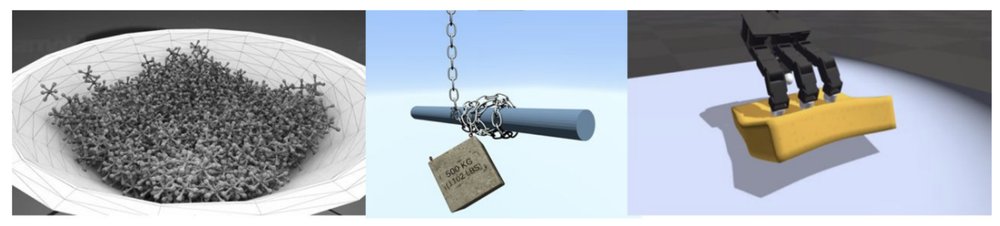{fig-align="center"}

## Paths forward: Neohookean elasticity
- Large deformation fractures used in animation and surgery simulations
- Emperical relationships to micromechanical properties

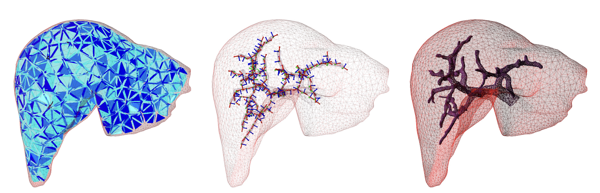{fig-align="center"}

::: aside
`sofa-framework.org`
:::

## Paths forward

- Fracture/fault first models address primary crustal observables

- The evolution of fault system geometry may be a combination of historical contingency, geometric constraints, and non-monotonic fracture evolution

- Frontiers and needs:
  - Non-signular fracture mechanics and energy focused models
  - New thinking about "material properties"
  - Models that explain observations of jammed and stiff motion (little creep, neglible long-term transients)
  - Non-linear (constraints and/or geometry and/or rheology) and sampled models

